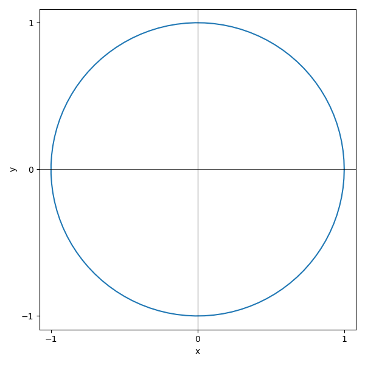

---
jupytext:
  formats: md:myst
  text_representation:
    extension: .md
    format_name: myst
kernelspec:
  display_name: Python 3
  language: python
  name: python3
---

````{admonition} Announcements & Reminders
:class: note
:class: dropdown


````


# 📖 Multivariate differential calculus (part 2)

<small>⏱ <span class="eta"></span> | <span class="words"></span> words</small>


````{dropdown} Sources and reading guide

```{figure} _static/img/bibliography/shsc2016.png
:width: 100px
:align: left
```
{cite:ps}`sydsaeter2016`

Chapters 11 and 12 (pp. 407-494).

<div style="clear: both"></div>

Introductory level references:
- {cite:ps}`bradley2008`: Chapter 7, Sections 1 to 3 (pp. 360-408).
- {cite:ps}`haeussler1987`: Chapter 17, Sections 1 to 7 and Sections 9 to 10 (pp. 668-706 and 714-723).
- {cite:ps}`shannon1995`: Chapter 10, Sections 1 to 6 (pp. 450-489).

Intermediate mathematical economics textbooks:
- {cite:ps}`chiang1984`: Chapters 6-8 and Chapter 10 (pp. 127-227 and 268-306).
- {cite:ps}`chiang2005`: Chapters 6 to 10 (pp. 124-290).
- {cite:ps}`simon1994`: Chapters 2 to 5 (pp. 10-103).

Mathematics textbooks:
- {cite:ps}`spiegel1981a`: Chapters 4, 6, 7 and 8; pp. 57-79 and 101-179.
- {cite:ps}`spiegel1981b`: Chapters 3 and 4; pp. 35-81.
````

> Today we will continue our discussion of differential calculus of single-real-valued multivariate functions, $f: X \subset \mathbb{R}^n \rightarrow Y \subset \mathbb{R}$.
> 
> We will be focussing on two concepts. These are **implicit functions** and **homogenous functions**.

## Implicit functions

Until now we have been working with explicit functions where the dependet variable, $y$, is on the left side of the equation and the independet variables, $x_i$, are on the right side

$$
y = f(x_1,x_2,\dots,x_n).
$$

Frequently, we have to work with equations where the dependent variable cannot be separated from the independent variables

$$
G(x_1,x_2,\dots,x_n,y) = c.
$$

We say that $G(x_1,x_2,\dots,x_n,y) = c$ represent a relationship between $y$ and $x$ that defines an implicit function $y$ of $x$.

When dealing with implicit functions we want to know the following two answers:
- Does $G(x_1,x_2,\dots,x_n,y) = c$ determine $y$ as a continuous implicit function of $(x_1,x_2,\dots,x_n)$?
- If so, how does changes in $x$ affect $y$?

```{admonition} Example: The line of the cicle
:class: tip

The unit cicle has the representation

$$
x^2 + y^2 = 1.
$$



Consider the point $x=0$, $y=1$. In the neighborhood of this point $y$ is an explicit function of $x$

$$
y(x) = \sqrt{x^2 - 1}.
$$

$y(x)$ can be represented by a different explicit function around the neighborhood at the point $x=0$, $y=-1$  

$$
y(x) = -\sqrt{x^2 - 1}.
$$

In contrast, $y$ cannot be represented by a well defined function around the points $(-1,0)$ and $(1,0)$.

```

```{admonition} Example: Polynomial equation of order five
:class: tip

Consider the polynomial equation

$$
y^5 + y^3 + y + x = 0.
$$

$x$ can be expressed as an explicit function of $y$

$$
x(y) = - y^5 - y^3 - y.
$$

However, polynomials of order $k \geq 5$ has no explicit solution. Hence, there exist no explicit function $y$ of $x$. Instead, the polynomial equation defines an implicit function for $y$ of $x$.

Suppose we could find a function $y=y(x)$ which solves this equation for any $x$

$$
y(x)^5 + y(x)^3 + y(x) + x = 0.
$$

Use the chain rule to find $y'(x)$

$$
5 y(x)^4 y'(x) + 3 y(x)^2 y'(x)  + y'(x) + 1 = 0 \\
\Leftrightarrow y'(x) =-\frac{1}{5 y(x)^4 + 3 y(x)^2 + 1} 
$$

The point $x=-3$, $y=1$ solves the polynomial equation, and 

$$
y'(3)=-\tfrac{1}{5 + 3 + 1} = -\tfrac{1}{8}
$$

We conclude that there exists an implicit function $y=y(x)$ in the neighborhood around (-3,1) that solves polynomial equation and it is differentiable.

```
<!-- 
```{admonition} Example
:class: tip

Consider the cubic implicit function

$$
x^2 - 3xy + y^3 = 7
$$

around the point $x=4$, $y=3$

$$
4^2 - 3xy + y^3 &= 7 \\
16 - 36 + 27 &= 7 \\
7 &= 7
$$

Suppose we could find a function $y=y(x)$ which solves this equation for any $x$

$$
x^2 - 3xy(x) + y(x)^3 = 7
$$

use the chain rule to find $y'(x)$

$$
2x- 3y(x) - 3xy'(x) + 3y(x)^2 y'(x) = 0 \\
\Leftrightarrow y'(x) =-\frac{2x - 3y}{3y^2 - 3x}
$$

Alternatively, we could have used total differentiation

$$
(2x - 3y)dx + (-3x + 3y^2)dy=0 \\
\Leftrightarrow y'(x)=\frac{dy}{dx} =-\frac{2x - 3y}{3y^2 - 3x}
$$

at $x=4$, $y=3$, we find

$$
y'(x)=-frac{8-9}{27 - 12}=\frac{1}{15}
$$

We conclude that there is a function $y(x)$ that solve the implicit function around $x=4$, $y=3$ and it is differentiable.
```
 -->
Now, let's carry this computation out more generally for the implicit function $G(x,y)=c$ around the specific point $x=x^*$, $y=y^*$, and let's suppose there exist a solution $y=y(x)$. Use the chain rule to differentiate wrt $x$

$$
\frac{\partial G\left(x^*, y(x^*)\right)}{\partial x}  + \frac{\partial G\left(x^*, y(x^*)\right)}{\partial y} y'(x)=0.
$$

Solving for $y'(x)$ yields

$$
y'(x) =-\frac{\tfrac{\partial G\left(x^*, y(x^*)\right)}{\partial x} }{\tfrac{\partial G\left(x^*, y(x^*)\right)}{\partial y}}.
$$

We see that if the solution $y(x)$ of $G(x,y)=c$ exists and is differentiable it is necessary that $\partial G\left(x_0, y(x_0)\right) /\partial y$ be nonezero. The **implicit function theorem** stated below implies that this necessary condition is also a sufficient condition.

```{admonition} Fact (Implicit function theorem I)
:class: important

Let $G\left(x, y\right)$ be a $C^1$ function around the point $(x^*,y^*)$ in $\mathbb{R}^2$. Suppose $G(x^*,y^*)=c$ and consider the expression

$$
G(x,y)=c.
$$

if $\partial G\left(x^*, y(x^*)\right) / \partial y \neq 0$, then there exists a $C^1$ function $y=y(x)$ defined in neighborhood around the point $x^*$ such that

- $G(x,y(x)) = c$ for all $x$ around $(x^*,y^*)$
- $y(x^*)=y^*$
- the derivative of $y$ wrt $x$ at $(x^*,y^*)$ is

$$
y'(x) =-\frac{\tfrac{\partial G\left(x^*, y(x^*)\right)}{\partial x} }{\tfrac{\partial G\left(x^*, y(x^*)\right)}{\partial y}}.
$$

```

The implicit function theorem provides conditions under which a relationship of the form $G(x,y)=c$ implies that there exists a implicit function $y=y(x)$ locally.

```{admonition} Example: The line of the cicle
:class: tip

When the implicit function theorem is applied to the line of the circle we get that

$$
y'(x) 
&= -\frac{\tfrac{\partial y^2 + x^2}{\partial x}}{\tfrac{\partial y^2 + x^2}{\partial y}} \\
&= -\frac{2x}{2y}
&= -\frac{x}{y}
$$

which is not defined in the point (-1,0) and (1,0) .
```

The implicit function theoriem can be extended to $G(x_1,x_2,\dots,x_n)=c$.

```{admonition} Fact (Implicit function theorem II)
:class: important

Let $\mathbf{x}=(x_1,x_2,\dots,x_n)$ and $G\left(\mathbf{x}, y\right)$ be a $C^1$ function around the point $(\mathbf{x}^*,y^*)$ in $\mathbb{R}^{n+1}$. Suppose $G(\mathbf{x}^*,y^*)=c$ and consider the expression

$$
G(\mathbf{x},y)=c.
$$

if $\partial G\left(\mathbf{x}^*, y(\mathbf{x}^*)\right) / \partial y \neq 0$, then there exists a $C^1$ function $y=y(\mathbf{x})$ defined in the neighborhood around the point $\mathbf{x}^*$ such that

- $G(\mathbf{x},y(\mathbf{x})) = c$ for all $\mathbf{x}$ around $(\mathbf{x}^*,y^*)$
- $y(\mathbf{x}^*)=y^*$
- for each $i$ the derivative of $y$ wrt $x_i$ is

$$
\frac{\partial y(\mathbf{x}^*)}{\partial x_i} = -\frac{\tfrac{\partial G\left(\mathbf{x}^*,y^*\right)}{\partial x_i} }{\tfrac{\partial G\left(\mathbf{x}^*,y^*\right)}{\partial y}}.
$$

```

```{admonition} Example: $G(x,y,z)=c$
:class: tip

Consider the relationship

$$
- 3 x^2 y + y z - 4 x z = 7.
$$

We will show that near $(-1,1,2)$ we can write $y=y(x,z)$ and we will find the partial $\partial y / \partial x$ to that point

$$
- 3 \cdot (-1)^2 \cdot 1 +  1 \cdot 2 - 4 \cdot (-1) \cdot 2 = - 3 + 2 + 8 = 7
$$

Find the partial derivatives of $G$ with respect to $y$ and $x$

$$
\frac{\partial G}{\partial x} = -6xy - 4z. \\
\frac{\partial G}{\partial y} = -3x^2 + z.
$$

The partial derivative is given by the implicit function theorem as

$$
\frac{\partial y}{\partial x} = -\frac{\tfrac{\partial G}{\partial x} }{\tfrac{\partial G}{\partial y}} = -\frac{-6xy - 4z}{-3x^2 + z}
$$

We conclude that there exists a $C^1$ function $y=y(x,z)$ in the neighborhood around the point (-1,1,2).

```

## Level sets

Level curves can be used to visualize single-real-valued bivariate functions, $f: X \subset \mathbb{R}^2 \rightarrow Y \subset \mathbb{R}$.

```{admonition} Fact (Level curve)
:class: important

A curve $\ell$ in $\mathbb{R}^2$ is called a level curve of $y=f(x_1,x_2)$ if the value of $f$ on every point of $\ell$ is some fixed $c$.

```

```{admonition} Example: Level curve
:class: tip

$x^2 + y^2 = c$ is the level curve of $z=x^2 + y^2$.

```

Similarly, level surfaces can be used to visualize single-real-valued trivariate functions, $f: X \subset \mathbb{R}^3 \rightarrow Y \subset \mathbb{R}$.

```{admonition} Fact (Level surface)
:class: important

A surface $S$ in $\mathbb{R}^3$ is called a level surface of $f(x_1,x_2,x_3)$ if the value of $f$ on every point of $S$ is some fixed $c$.

```

```{admonition} Example: Level surface
:class: tip

$x^2 + y^2 - z = c$ is the level surface of $w=x^2 + y^2 - z$.

```

```{admonition} Fact (Level sets)
:class: important

A manifold $M$ in $\mathbb{R}^n$ is called a level set of $f(x_1,x_2,\dots,x_n)$ if the value of $f$ on every point of $M$ is some fixed $c$.

```

### The slope of an isoquant curve

Suppose that $f: \mathbb{R}_{+}^{2} \rightarrow \mathbb{R}_{+}$ is a production function.

$$
Q = f(K,L).
$$

The level curve of the production function represent a relationship between the capital (K) and labor (L) inputs that keeps the production constant at $c$

$$
f(K,L) = c.
$$

Given the specified production function we might be able to find an explicit or implicit function for the isoquant curve, $L=L(K)$. In both cases we can use the implicit function theorem to calculate the slope of the isoquant curve.

$$
\frac{\partial f(K,L)}{\partial K} + \frac{\partial f(K,L)}{\partial L} \frac{\partial L(K)}{\partial K} = 0 \\
\Leftrightarrow \frac{\partial L(K)}{\partial K} = -\frac{\tfrac{\partial f(K,L)}{\partial K}}{\tfrac{\partial f(K,L)}{\partial L}}
$$

The slope of the isoquant curve is referred to as the **marginal rate of technical substitution**

$$
\text{MRTS}_{LK} = -\frac{\tfrac{\partial f(K,L)}{\partial K}}{\tfrac{\partial f(K,L)}{\partial L}}.
$$

It measures how much of one input would be needed to compensate for a one-unit loss of the other while keeping the production at the same level.

Marginal rate of technical substitution between input $x_i$ and $x_j$ of a multivariate function is defined as

$$
\text{MRTS}_{x_i,x_j} = -\frac{\tfrac{\partial f(x_1,x_2,\dots,x_n)}{\partial j}}{\tfrac{\partial f(x_1,x_2,\dots,x_n)}{\partial j}}.
$$

```{admonition} Example: $f(K,L,T)=c$
:class: tip

Consider the level surface of the Cobb-Douglas function of three inputs (capital, labor, and land)

$$
A C^{\alpha} L^{\beta} T^{\delta} = c
$$

Calculate the marginal rate of substitution between capital and labor

$$
\alpha A C^{\alpha-1} L^{\beta} T^{\delta} \frac{\partial C(L,T)}{\partial L} + \beta A C^{\alpha} L^{\beta-1} T^{\delta} = 0 \\
\Leftrightarrow \frac{\partial C(L,T)}{\partial L} = -\frac{\beta A C^{\alpha} L^{\beta-1} T^{\delta}}{\alpha A C^{\alpha-1} L^{\beta} T^{\delta}} = \frac{\beta}{\alpha} \frac{C}{L}
$$

Calculate the marginal rate of substitution between capital and land

$$
\alpha A C^{\alpha-1} L^{\beta} T^{\delta} \frac{\partial C(L,T)}{\partial T} + \delta A C^{\alpha} L^{\beta} T^{\delta-1} = 0 \\
\Leftrightarrow \frac{\partial C(L,T)}{\partial L} = -\frac{\delta A C^{\alpha} L^{\beta} T^{\delta-1}}{\alpha A C^{\alpha-1} L^{\beta} T^{\delta}} = \frac{\delta}{\alpha} \frac{C}{T}
$$

Calculate the marginal rate of substitution between labor and land

$$
\beta A C^{\alpha} L^{\beta-1} T^{\delta}\frac{\partial L(C,T)}{\partial T} + \delta A C^{\alpha} L^{\beta} T^{\delta-1} = 0 \\
\Leftrightarrow \frac{\partial L(C,T)}{\partial T} = -\frac{\delta A C^{\alpha} L^{\beta} T^{\delta-1}}{\beta A C^{\alpha} L^{\beta-1} T^{\delta}} = \frac{\delta}{\beta} \frac{L}{T}
$$
```

## Homogeneous functions

Consider a function $f: S \longrightarrow \mathbb{R}$, where $S \subseteq \mathbb{R}^{n}$. Let $\lambda>0$ be a positive real number.

```{admonition} Definition
:class: caution

The function $f\left(x_{1}, x_{2}, \cdots, x_{n}\right)$ is said to be **homogeneous of degree $r$** if

$$
f\left(\lambda x_{1}, \lambda x_{2}, \cdots, \lambda x_{n}\right)=\lambda^{r} f\left(x_{1}, x_{2}, \cdots, x_{n}\right)
$$

for all $\left(x_{1}, x_{2}, \cdots, x_{n}\right) \in S$ and all $\lambda>0$.
```

```{admonition} Example
:class: tip

The function 

$$
3x^5 y + 2x^2 y^4 - 3 x^3 y^3,
$$

is homogenous if degree 6

$$
3(\lambda x)^5 (\lambda y) + 2(\lambda x)^2 (\lambda y)^4 - 3 (\lambda x)^3 (\lambda y)^3
&= 3\lambda^5 x^5 \lambda y + 2\lambda^2 x^2 \lambda^4 y^4 - 3 \lambda^3 x^3 \lambda^3 y^3 \\
&= 3\lambda^6 x^5 y + 2\lambda^6 x^2 y^4 - 3 \lambda^6 x^3 y^3 \\
&= \lambda^6 \left(3 x^5 y + 2 x^2 y^4 - 3 x^3 y^3 \right).
$$

The function 

$$
3x^{3/4} y^{1/4} + 6x + 4,
$$

is not homogenous

$$
3(\lambda x)^{3/4} (\lambda y)^{1/4} + 6(\lambda x) + 4  = 3 \lambda x^{3/4} y^{1/4} + 6\lambda x + 4.
$$

```

```{admonition} Definition
:class: caution

A function that is homogeneous of degree one is said to be **linearly homogeneous**.
```

```{admonition} Definition
:class: caution

Let $z=f(x)$ be a $C^1$ function. If $f$ is homogenous of degree $r$, its first order partial derivatives are homogenous of degree $r-1$.
```

By definition

$$
f(\lambda x_1, \lambda x_2, \dots, \lambda x_n) = \lambda^r f(x_1,x_2,\dots,x_n).
$$

Use the chain rule wrt x_i on both sides of the equation

$$
\frac{\partial f(\lambda x_1, \lambda x_2, \dots, \lambda x_n)}{\partial x_i} \lambda = \lambda^r \frac{\partial f(x_1,x_2,\dots,x_n)}{\partial x_i},
$$

and divide both sides by $t$

$$
\frac{\partial f(\lambda x_1, \lambda x_2, \dots, \lambda x_n)}{\partial x_i} = \lambda^{r-1} \frac{\partial f(x_1,x_2,\dots,x_n)}{\partial x_i}.
$$

```{admonition} Fact 
:class: important

Let $q=f(x)$ be a $C^1$ homogenous function on $\mathbb{R}^n_+$. The tangent planes to the level sets of $f$ have constant slope along each ray from the origin.

```

Consider the homogenous production function on $\mathbb{R}^2_+$. We want to show that the MRTS is constant along rays from the origin. Let $(\lambda L_0,\lambda K_0)=(L_1, K_1)$. The MRTS between input $L$ and $K$ at $(L_1, K_1)$ equals

$$
\frac{f_{K}(L_1, K_1)}{f_{L}(L_1, K_1)} 
&= \frac{f_{K}(\lambda L_0,\lambda K_0)}{f_{L}(\lambda L_0,\lambda K_0)} \\
&= \frac{\lambda^{r-1} f_{K}( L_0, K_0)}{\lambda^{r-1} f_{L}( L_0, K_0)} \\
&= \frac{f_{K}(L_0, K_0)}{f_{L}( L_0, K_0)} \\
$$

## Euler's theorem

```{admonition} Fact (Euler's theorem)
:class: important

Suppose that the function $f\left(x_{1}, x_{2}, \cdots, x_{n}\right)$ is homogeneous of degree $r$. In this case we have

$$
\sum_{i=1}^{n} x_{i}\frac{\partial f}{\partial x_{i}}\left(\mathbf{x} \right)=r f\left(\mathbf{x}\right).
$$  
```

Recall the definition of a homogenous function of degree $r$

$$
f(\lambda \mathbf{x}) = \lambda^{r} f(\mathbf{x}). 
$$

Differentiate both sides wrt $\lambda$

$$
\sum_{i=1}^{n} x_{i}\frac{\partial f}{\partial x_{i}}\left(\lambda \mathbf{x} \right) = r \lambda^{r-1} f(\mathbf{x}). 
$$

Set $\lambda=1$.

### Returns to scale

Suppose that an $n$ input and one output production technology can be represented by a homogenous production function of the form

$$
Q=f\left(L_{1}, L_{2}, \cdots, L_{n}\right) .
$$

The production technology is said to display:
- **decreasing returns to scale**: $f\left(\lambda L_{1}, \lambda L_{2}, \cdots, \lambda L_{n}\right)<\lambda Q$.
- **constant returns to scale**: $f\left(\lambda L_{1}, \lambda L_{2}, \cdots, \lambda L_{n}\right)=\lambda Q$.
- **increasing returns to scale**: $f\left(\lambda L_{1}, \lambda L_{2}, \cdots, \lambda L_{n}\right)>\lambda Q$.

### Cobb-Douglas production functions

Suppose that an two input and one output production technology can be represented by a production function of the form

$$
Q=f(L, K)=A L^{\alpha} K^{\beta} .
$$

This type of production function is known as a Cobb-Douglas production function.


Suppose that $\lambda>0$. Note that

$$
\begin{aligned}
f(\lambda L, \lambda K) & =A(\lambda L)^{\alpha}(\lambda K)^{\beta} \\
& =A \lambda^{\alpha} L^{\alpha} \lambda^{\beta} K^{\beta} \\
& =\lambda^{\alpha+\beta} A L^{\alpha} K^{\beta} \\
& =\lambda^{\alpha+\beta} f(L, K)
\end{aligned}
$$

Thus we know that the Cobb-Douglas production function is homogeneous of degree $(\alpha+\beta)$.

- If $(\alpha+\beta)<1$, then the Cobb-Douglas production function displays decreasing returns to scale;
- If $(\alpha+\beta)=1$, then the Cobb-Douglas production function displays constant returns to scale; and
- If $(\alpha+\beta)>1$, then the Cobb-Douglas production function displays increasing returns to scale.

## Homothetict function

```{admonition} Definition
:class: caution

Let $I$ be an interval on the real line. Then, $g: I \rightarrow \mathbb{R}$ is a monotonic transformation of $I$ if $g$ is a strictly increasing function on $I$.

```

<!-- ```{admonition} Definition
:class: caution

If $\mathbf{x}, \mathbf{y} \in \mathbb{R}^n$, write

$$
\mathbf{x} \geq \mathbf{y} \text{ if } x_i \geq y_i \text{ for all i=1,2,...,n,}
$$

$$
\mathbf{x} > \mathbf{y} \text{ if } x_i > y_i \text{ for all i=1,2,...,n.}
$$

A function $u: \mathbb{R}^n_+ \rightarrow \mathbb{R}$ is **monotone** if for all $\mathbf{x}, \mathbf{y} \in \mathbb{R}^n$,

$$
x \geq y \Rightarrow u(\mathbf{x}) > u(\mathbf{y}).
$$

The function is strictly **monotone** if for all $\mathbf{x}, \mathbf{y} \in \mathbb{R}^n$

$$
x > y \Rightarrow u(\mathbf{x}) > u(\mathbf{y}).
$$
``` -->

```{admonition} Definition
:class: caution

A function $v: \mathbb{R}_{+}^n \rightarrow \mathbb{R}$ is called homothetic if it is a monotone transformation, $g(z)$, of a homogenous function $u: \mathbb{R}_{+}^n \rightarrow \mathbb{R}$

$$
v(x) = g\left(u(\mathbf{x})\right)
$$

for all $\mathbf{x}$ in the domain.
```

```{admonition} Example: $G(x,y,z)=c$
:class: tip

The two functions 

$$
v_1(x,y)=x^3y^3 + xy \\
v_2(x,y)=xy + 1,
$$

are homothetic functions with $u(x,y)=xy$ and the monotonic transformations

$$
g_1(x,y) = z^3 + z \\
g_2(x,y) = z + 1,
$$

respectively.
```

```{admonition} Definition
:class: caution

Let $u: \mathbb{R}_{+}^n \rightarrow \mathbb{R}$ be a strictly monotonic function. Then, $u$ is a homothetic if and only if for all $\mathbb{x}$ and $\mathbb{y}$ in $\mathbb{R}^n_+$,

$$
u(\mathbf{x}) \geq u(\mathbf{y}) \Leftrightarrow u(\alpha \mathbf{x}) \geq u(\alpha \mathbf{y}) \text{ for all } \alpha > 0.
$$
```

```{admonition} Definition
:class: caution

Let $u$ be a $C^1$ function on $\mathbb{R}^n_+$. If $u$ is homothetic then the slopes of the tangent planes of the level sets of $u$ are constant along each ray from the origin.
```

